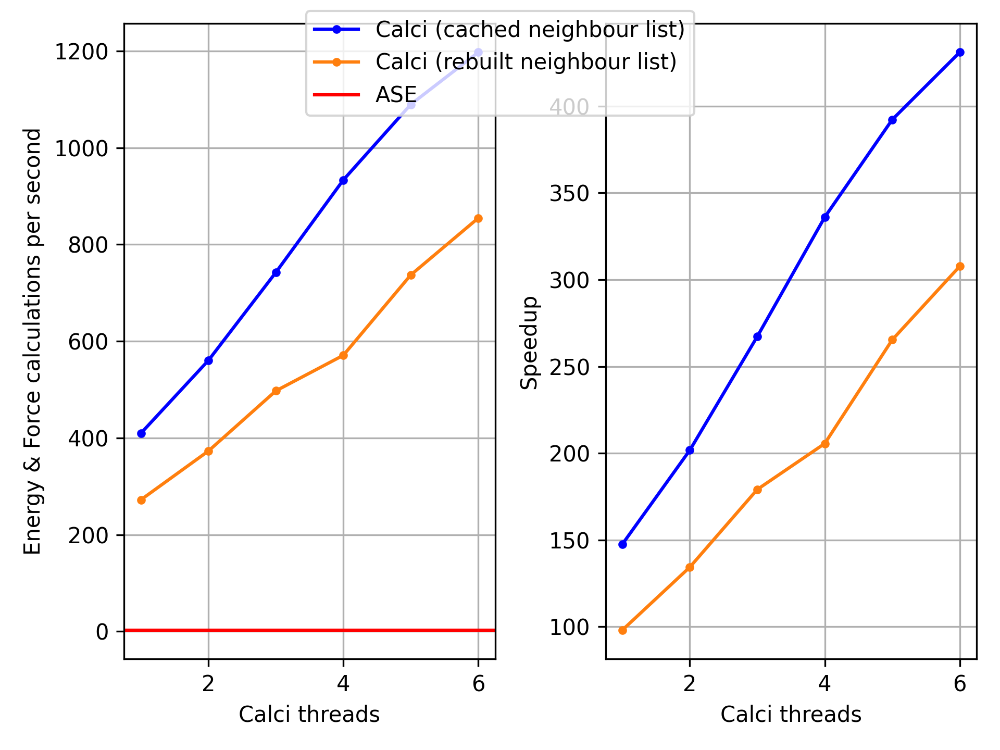

# Calci

So far, implements a fast Lennard-Jones calculator for ASE.

## Comparison with ASE's built-in calculator

Calci provides an ASE-compatible calculator interface for the same
Lennard-Jones energy and force model as ASE's built-in `LennardJones`
calculator. Its main focus is faster repeated energy and force evaluation: the
pair calculation is implemented in C++, uses a cached neighbour list, and can
run across multiple CPU threads.

| Feature | Calci | ASE `LennardJones` |
| --- | --- | --- |
| Implementation | Compiled C++ with OpenMP | Python and NumPy |
| ASE calculator workflow | Supported | Supported |
| CPU threading | Configurable with `pycalci.set_num_threads(2)` or `export OMP_NUM_THREADS=2` | No calculator-specific thread setting |
| Neighbour-list reuse with finite skin depth | Cached by default; set `verlet_skin_depth = 0.0` to rebuild every call | Cached by ASE's `NeighborList` |
| Parameters | Global `epsilon`, `sigma`, and `rc`, plus optional type-specific parameter mappings | Global `epsilon`, `sigma`, `rc`, and `ro` |
| Cutoff behavior | Shifted energy at the cutoff, matching `smooth=False` | Shifted or smooth cutoff |
| Results | Total energy, forces, and pairwise virial; general virial is optional | Total and per-atom energies, forces, and stress |

Calci can be attached to an ASE `Atoms` object in the usual way:

```python
from pycalci.calculators import LennardJones

atoms.calc = LennardJones(
    epsilon=1.0,
    sigma=1.0,
    rc=3.0,
)
energy = atoms.get_potential_energy()
forces = atoms.get_forces()
```

ASE's implementation currently exposes more standard calculator properties,
including per-atom energies and stress. Calci targets the common total-energy
and force path, where its compiled and threaded implementation can provide a
substantial speedup. The exact gain depends on the system, cutoff, neighbour-
list rebuild frequency, and thread count; the workload below is one concrete
comparison rather than a universal performance claim.

## Benchmark

The benchmark compares Calci's Lennard-Jones calculator with the
[ASE Lennard-Jones calculator](https://wiki.fysik.dtu.dk/ase/ase/calculators/lj.html).
It calculates the energy and forces of 512 atoms arranged on a slightly
perturbed `8 x 8 x 8` grid. Periodic boundary conditions are disabled and the
cutoff is set to include every atom pair. To avoid ASE's result cache, both
calculators' high-level `calculate()` methods are invoked directly. Calci's
optional general-virial calculation is left at its default of `False`. Calci is
measured both with its neighbour list cached and with the list rebuilt before
every calculation. The latter is forced by setting the Verlet skin depth to
zero, which disables reuse without changing the cutoff. The plotted time is the
average of 1,000 calculations for each Calci case and 10 calculations for ASE,
following warm-up calls.

Calci was measured with one to six CPU threads. With the neighbour list cached,
it completed approximately 367 calculations per second with one thread and
1,285 with six threads. Rebuilding the list every time reduced throughput to
272 and 963 calculations per second, respectively. ASE completed approximately
2.4 calculations per second. For this workload, the resulting speedup over ASE
ranges from about 155x to 543x with caching and 115x to 407x with rebuilding.



The benchmark was run on a Dell XPS 15 9500 with an Intel Core i7-10750H CPU
(6 cores, 12 threads, 2.60 GHz base and up to 5.00 GHz), 32 GB of RAM, and
Ubuntu Linux. The calculation is CPU-only; the laptop's GPUs were not used.

To reproduce the benchmark from the repository root:

```bash
cd benchmark
python benchmark.py
python plot.py
```

## Installation

To install, clone the repository and run `pip install`:
```bash
pip install .
```

*NOTE:* The `pip install` command will try to compile the C++ source code and build a binary wheel. 
Hence, this step depends on your system being equipped with a working `C++` compiler and the necessary build tools. 
We recommend to obtain them from the shipped conda `environment.yml` file. 
See below:

## Obtaining build dependencies
We use micromamba here, but `conda` or `mamba` will work just as well.
First create the environment, then activate it.

```bash
micromamba create -f environment.yml # only once
micromamba activate calcienv # every time 
```
After you have activated the environment it should be possible to install fixi with `pip install .`

## Advanced building and running the tests

We use `meson` as the build system: 

```bash
meson setup build
meson compile -C build
```

To run the `C++` unit tests:
```bash
meson test -C build
```

To run the tests in `Python` (which are in `pytest`): 

```bash
pytest -v
```
